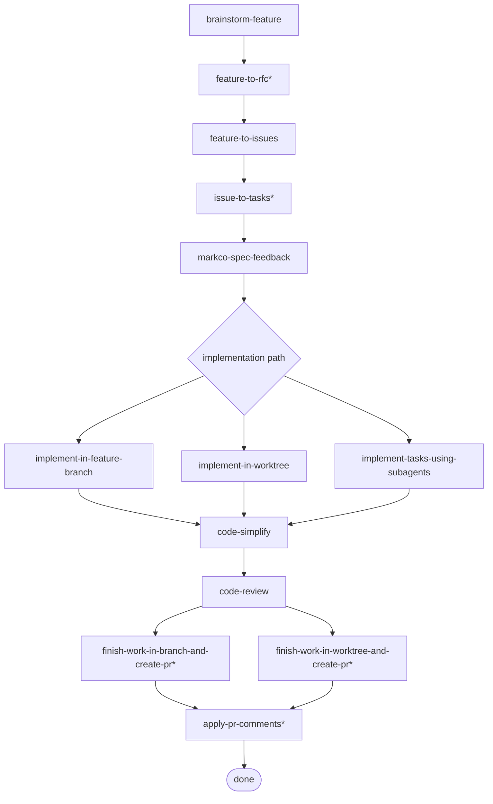
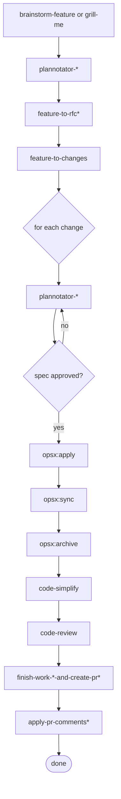
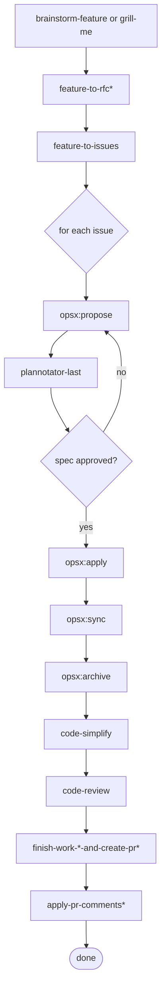

# Overview

AI-SDLC skills and general-purpose skills that I use everyday.

# Install skill in a repo or globally

Install a specific skill from this repo

```sh
npx skills@latest add sathish316/skills --skill brainstorm-feature
```

Install all skills from this repo

```sh
npx skills@latest add sathish316/skills --skill '*'
```

# Usage

## For large features ([flowchart](docs/devskills-decision-tree-flowchart.md))

1. /write-prd
2. /prd-to-rfc (Optional if Tech design doc is needed)
3. /prd-to-issues
4. /issue-to-tasks (Optional if the issue is large enough to be broken down into tasks)
5. *code* each issue or task (Just prompt or use implement-* skills)
6. /code-simplify
7. /code-review
8. /final-review-and-create-pr

## For medium/small features ([flowchart](docs/devskills-workflow-flowchart.md))

1. /brainstorm-feature
2. /feature-to-rfc (Optional if Tech design doc is needed)
3. /feature-to-issues
4. /issue-to-tasks (Optional if the issue is large enough to be broken down into tasks)
5. *code* each issue or task (Just prompt or use implement-* skills)
6. /code-simplify
7. /code-review
8. /finish-work-*-and-create-pr (for each issue or task if needed) 
9. /apply-pr-comments (for each issue or task if needed)

(Steps marked in * are optional)



## For medium/small features with OpenSpec and Plannotator flows ([flowchart](docs/devskills-workflow-flowchart.md))

1. /brainstorm-feature
2. /feature-to-rfc (Optional if Tech design doc is needed)
3. /feature-to-issues
4. For each issue, Spec and Implement:
    - /opsx:propose to create specs for a feature or issue
    - /plannotator-last to review specs created for feature or issue
    - /opsx:apply to implement a feature or issue
    - /opsx:sync and /opsx:archive to merge delta specs with overall specs and archive delta specs and todos
5. /code-simplify
6. /code-review
7. /finish-work-*-and-create-pr (for each issue or task if needed) 
8. /apply-pr-comments (for each issue or task if needed)

(Steps marked in * are optional)

If you prefe the simple 2-level hierarchy of feature -> changes, you can use the following flowchart:



If you prefer the 3-level hierarchy of feature -> issues -> changes, you can use the following flowchart:




## For minor features

1. Just ask the agent to *code* the feature
2. /code-simplify
3. /code-review
4. /create-pr

## Standalone skills

1. pr-reviewer

Review remote github/bitbucket PR and post comment

2. project-scrum

Hierarchically rolls up project status from OpenSpec specs → tasks → issues → features → plans into a single color-coded scrum report. Run `/project-scrum` when you want an instant snapshot of where every layer stands — what shipped, what's in flight, and what's blocked — without opening a single planning file.

3. grill-me

Get relentlessly interviewed about a plan or design until every branch of the decision tree is resolved. Source: `resources/mattpocock-skills/grill-me/SKILL.md`, from [Matt Pocock's `grill-me` skill](https://github.com/mattpocock/skills/blob/main/skills/productivity/grill-me/SKILL.md).

4. github-merge-queue

Land approved GitHub PRs through a serialized merge queue: enable GitHub's native merge queue (with its org/plan eligibility rules), use hosted alternatives like Mergify for private repos, or run the self-hosted git-based worker (`scripts/git-merge-queue.sh`) that stacks approved PRs in a disposable branch, runs CI, drops conflicting/failing ones, and fast-forwards `main` only when the stack is green.

# Resources

Other similar skills resources:
* https://github.com/addyosmani/agent-skills
* https://github.com/mattpocock/skills
* https://github.com/maiobarbero/my-ai-workflow
* https://github.com/obra/superpowers
* https://github.com/garrytan/gstack

# Skill-specific docs

## Codewiki skill

Install codewiki skills in a repo:

```sh
npx skills@latest add sathish316/skills --skill codewiki
npx skills@latest add sathish316/skills --skill codewiki-viewer
```

Ask your Coding agent to generate and serve Codewiki

```
Use codewiki skill to generate comprehensive documentation for this repo.
```

```
Use codewiki-viewer skill to serve html documentation
```
