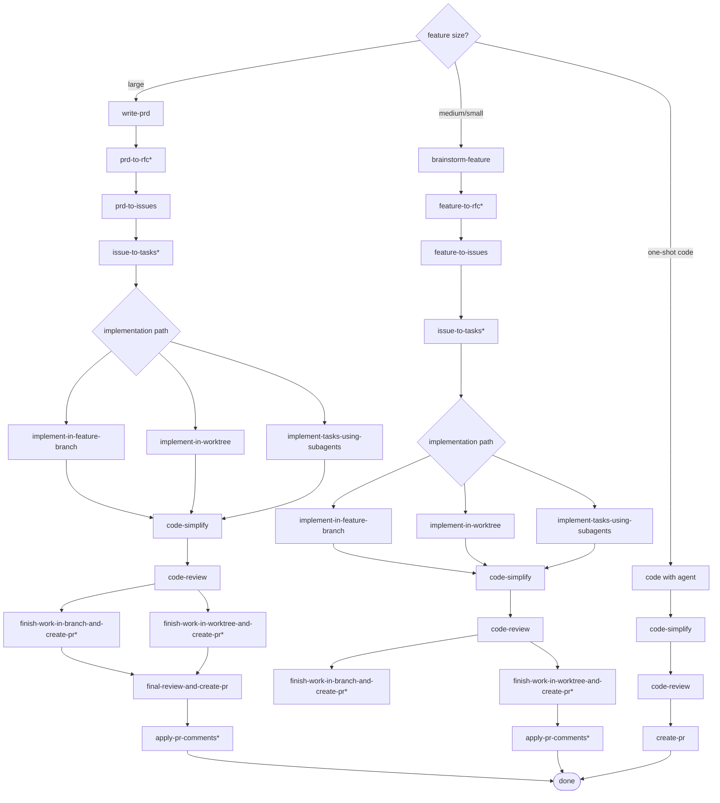

# Devskills Decision Tree Flowchart

Format: Mermaid Markdown. This keeps the decision tree editable in the repo and renderable in GitHub/Cursor Markdown preview.

Source: user-provided devskills usage workflow, recorded 2026-05-08.

