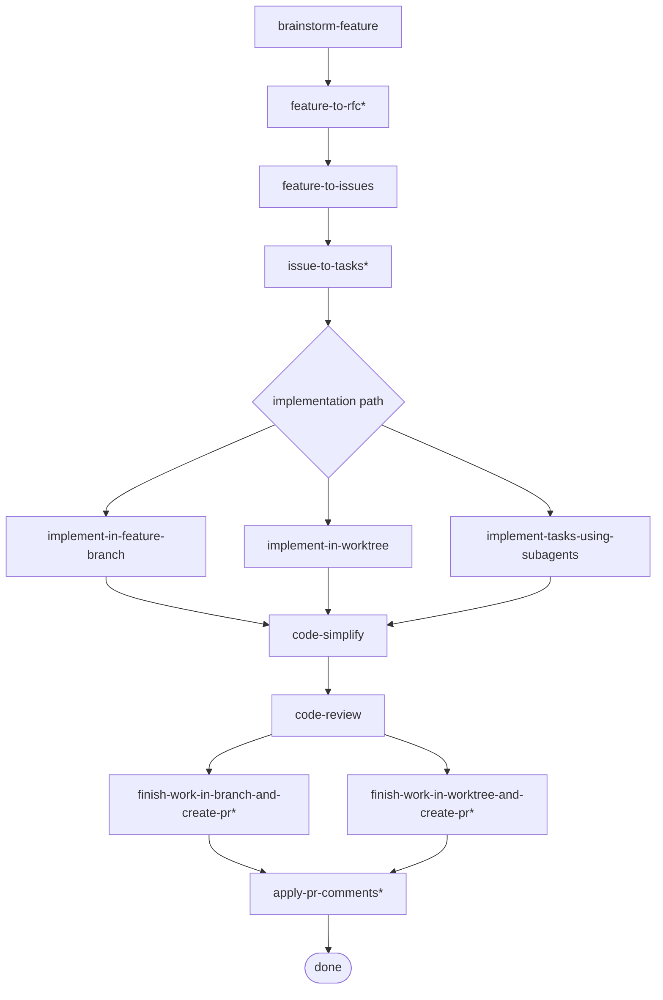

<b>Devskills Workflow</b>

```mermaid
flowchart TD
    A[brainstorm-feature] --> B["feature-to-rfc*"]
    B --> C[feature-to-issues]
    C --> D["issue-to-tasks*"]
    D --> E{implementation path}
    E --> F[implement-in-feature-branch]
    E --> G[implement-in-worktree]
    E --> H[implement-tasks-using-subagents]
    F --> I[code-simplify]
    G --> I
    H --> I
    I --> J[code-review]
    J --> L["finish-work-in-branch-and-create-pr*"]
    J --> M["finish-work-in-worktree-and-create-pr*"]
    L --> N["apply-pr-comments*"]
    M --> N
    N --> O([done])
```
