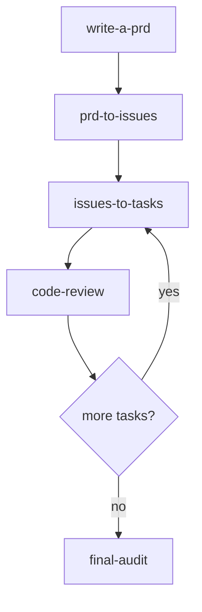

<b>My AI-Assisted Workflow</b>

Source: https://github.com/maiobarbero/my-ai-workflow README

```mermaid
flowchart TD
    A[write-a-prd] --> B[prd-to-issues]
    B --> C[issues-to-tasks]
    C --> D[code-review]
    D --> E{more tasks?}
    E -- yes --> C
    E -- no --> F[final-audit]
```
