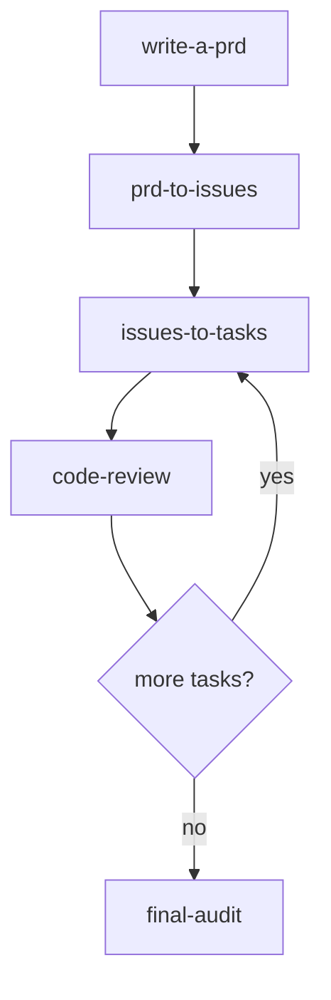

# My AI-Assisted Workflow Flowchart

Format: Mermaid Markdown. This is preferable to PNG because the workflow is text-first, process-oriented, and likely to evolve; Mermaid stays editable, renders on GitHub, and avoids storing a derived binary image.

Source: https://github.com/maiobarbero/my-ai-workflow README, verified 2026-05-08.

