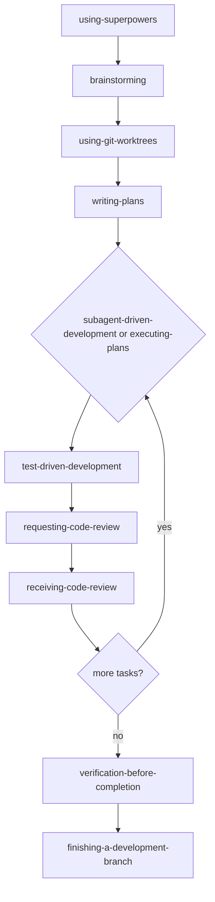

# Typical Superpowers Workflow

Format: Mermaid Markdown. This is preferable to PNG for this workflow because it stays editable, diffs cleanly in git, and renders directly in GitHub-flavored Markdown.

Source: https://github.com/obra/superpowers README, verified 2026-05-08.

