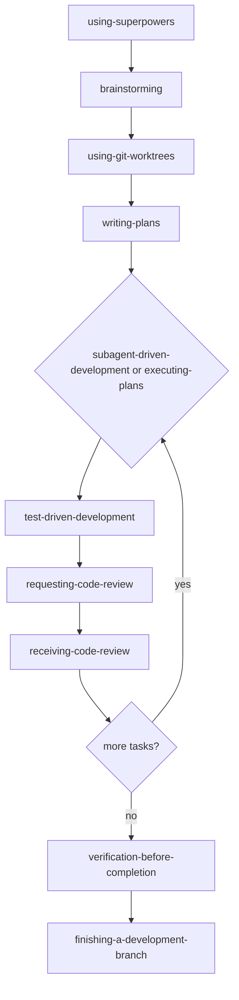

<b>Superpowers Workflow</b>

```mermaid
flowchart TD
    A[using-superpowers] --> B[brainstorming]
    B --> C[using-git-worktrees]
    C --> D[writing-plans]
    D --> E{subagent-driven-development or executing-plans}
    E --> F[test-driven-development]
    F --> G[requesting-code-review]
    G --> H[receiving-code-review]
    H --> I{more tasks?}
    I -- yes --> E
    I -- no --> J[verification-before-completion]
    J --> K[finishing-a-development-branch]
```
