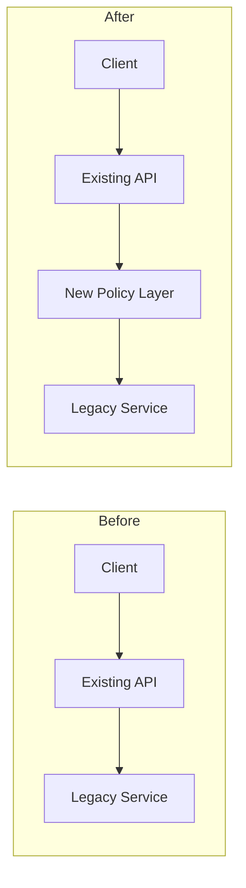
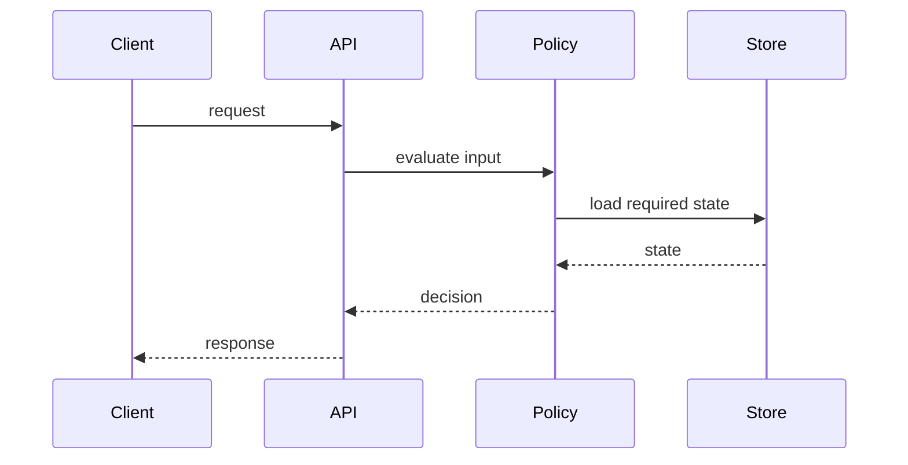
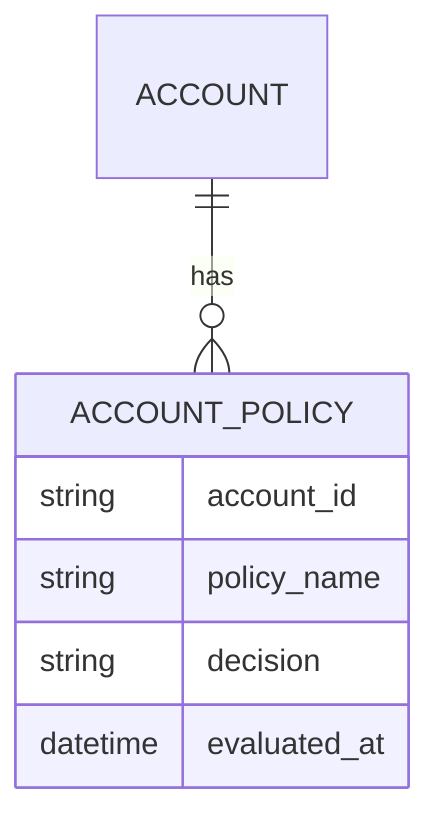

# PR Walkthrough

Use this skill to explain a PR as a compact technical document. The document is for engineers who need to understand the delta quickly: what changed, why it changed, how it was implemented, and what design tradeoffs matter.

The output is an HTML file in a temp directory outside the repository, usually `/tmp/pr-walkthroughs/<pr-slug>.html` or `$TMPDIR/pr-walkthroughs/<pr-slug>.html`, with Mermaid diagrams and abstracted code snippets. Focus on the PR delta, not a full codebase tour. These walkthroughs are transient understanding artifacts and should not be added to the repo or committed unless the user explicitly asks.

## Inputs

Gather the strongest available inputs, in this order:

1. PR metadata: title, description, source/target branch, author intent, linked tickets, linked specs.
2. Specs: OpenSpec change files, feature specs, PRD/RFC/design docs, acceptance criteria, task files, or issue files referenced by the PR.
3. Code delta: changed files, unified diff, renamed/deleted files, migrations, tests.
4. Existing architecture context: nearby modules, public APIs, data model definitions, sequence entry points, tests, and call paths touched by the diff.

If the user did not provide a PR URL/number, infer the current branch PR from available tools. If no PR tool is available, use local git diff against the target branch. If the target branch is unknown, infer it from PR metadata or ask for it.

Useful commands when shell access exists:

```bash
git branch --show-current
git status --short
git remote -v
git diff --name-status origin/main...HEAD
git diff origin/main...HEAD
```

For OpenSpec, inspect likely files under:

```text
openspec/changes/<change-id>/
docs/changes/
docs/features/
docs/issues/
docs/tasks/
```

Use repository-native PR tools, Bitbucket/GitHub tools, or MCP tools when they provide cleaner PR metadata and diffs than terminal parsing.

## Workplan

### 1. Establish Scope

Identify:

- PR identity: title, URL/ID, source branch, target branch, head SHA.
- Intent: one-sentence problem and one-sentence outcome.
- Spec linkage: which spec/change/task artifacts explain the intended behavior.
- Delta inventory: changed modules, files, public APIs, database/schema changes, config changes, test changes.

Separate source-of-truth intent from implementation observations. If specs and code disagree, call out the mismatch briefly in the HTML.

### 2. Understand Current Architecture

Read only enough existing code to explain the before-state touched by the PR:

- Key components/modules before this PR.
- Existing request/job/event flow.
- Existing data model or external contract.
- Existing extension points the PR uses.

Keep this section concise. It exists to make the delta understandable, not to document the whole system.

### 3. Analyze the Delta

Classify changes by function:

- Interface/API/contract changes
- Domain or service logic changes
- Persistence/data model changes
- UI/client changes
- Async/job/event changes
- Config/infra/feature flag changes
- Tests and verification changes

For each category, record:

- Before behavior
- After behavior
- Why this changed, sourced from specs or PR description when possible
- Files that matter most
- Risks, tradeoffs, or compatibility notes

Prefer a few high-signal examples over exhaustive file-by-file narration.

### 4. Build Diagrams First

Create visuals that explain the delta faster than prose:

- Architecture delta: Mermaid flowchart showing before/after components or changed edges.
- Sequence delta: Mermaid sequence diagram for the most important runtime path.
- Data model delta: Mermaid ER diagram or concise table for schema/entity changes.
- Optional dependency map: Mermaid graph for module relationships when many files changed.

Use labels like `Before`, `After`, `New`, `Changed`, and `Removed`. Keep diagrams small enough to fit on one screen. If a diagram is too large, split it.

### 5. Abstract Code Snippets

Use code snippets to explain the mechanism, not to reproduce the patch.

Rules:

- Keep each snippet under about 20 lines.
- Include only the meaningful shape: function signature, important branch, changed field, new call, or removed dependency.
- Replace unimportant bodies with comments such as `// validation omitted` or `// existing mapping unchanged`.
- Prefer pseudo-diff or before/after snippets when that clarifies the delta.
- Link to files and line numbers when possible, but do not paste long hunks.
- Mark every snippet with a syntax-highlighting language class in the final HTML, such as `<code class="language-ts">`, `<code class="language-java">`, `<code class="language-json">`, `<code class="language-bash">`, or `<code class="language-diff">`. Use `<code class="language-text">` only for pseudo-structure.

Good snippet pattern:

```ts
// Before: eligibility was derived only from account state.
const eligible = account.status === "active";

// After: spec-backed policy adds plan and regional checks.
const eligible = policy.evaluate({
  accountStatus: account.status,
  plan: account.plan,
  region: request.region,
});
```

### 6. Write the HTML

Create a single self-contained HTML document unless the user asks for multiple pages. Use `assets/template.html` from this skill as a starting point when convenient.

Default output path:

```text
/tmp/pr-walkthroughs/<pr-number-or-branch-slug>.html
```

If the platform provides a writable `$TMPDIR`, prefer:

```text
$TMPDIR/pr-walkthroughs/<pr-number-or-branch-slug>.html
```

Do not write walkthrough HTML under `docs/`, `codewiki/`, or any tracked repository path by default. The document is meant to help understand the PR, not become project documentation.

After writing the HTML, open it for the user. Prefer the environment's normal browser/file opener when available:

```bash
open /tmp/pr-walkthroughs/<pr-number-or-branch-slug>.html
```

If the environment is headless, remote, or opening a browser is not permitted, skip the opener and report the absolute HTML path clearly.

Keep the document concise:

- Target 800-1800 words for normal PRs.
- Use diagrams, tables, and compact callouts instead of long prose.
- Put the highest-value delta summary in the first viewport.
- Avoid generic explanations of what PRs, specs, Mermaid, or architecture diagrams are.

## Required HTML Structure

Use this structure unless the PR clearly needs a small adjustment:

```html
<main>
  <header>
    <p class="eyebrow">PR Walkthrough</p>
    <h1>[PR title]</h1>
    <p class="summary">[One sentence: what changed and why]</p>
    <dl class="meta">[PR, branches, spec links, head SHA]</dl>
  </header>

  <section id="delta">
    <h2>Delta Summary</h2>
    [3-6 bullets or cards: changed areas and impact]
  </section>

  <section id="why">
    <h2>Why This Changed</h2>
    [Spec intent, acceptance criteria, problem statement]
  </section>

  <section id="architecture">
    <h2>Architecture Delta</h2>
    [1 concise current architecture paragraph]
    [Mermaid architecture delta diagram]
  </section>

  <section id="design">
    <h2>High Level Design</h2>
    [Components, responsibilities, integration points]
  </section>

  <section id="low-level">
    <h2>Low Level Design</h2>
    [Data model changes table/ERD, contracts, config]
    [Sequence diagram]
  </section>

  <section id="walkthrough">
    <h2>PR Walkthrough</h2>
    [Changed-file groups with abstracted code snippets]
  </section>

  <section id="tradeoffs">
    <h2>Tradeoffs and Risks</h2>
    [Short table: decision, benefit, cost/risk, mitigation]
  </section>

  <section id="verification">
    <h2>Verification</h2>
    [Tests added/changed, manual checks, unverified gaps]
  </section>
</main>
```

## Visual Patterns

### Architecture Delta



### Sequence Delta



### Data Model Delta

Use an ER diagram for relational/entity changes:



Use a compact table when the change is smaller:

```html
<table>
  <thead><tr><th>Entity</th><th>Change</th><th>Reason</th></tr></thead>
  <tbody>
    <tr><td>AccountPolicy</td><td>New table</td><td>Persist policy decisions for audit</td></tr>
  </tbody>
</table>
```

## Content Rules

- Lead with findings about the PR delta, not process narration.
- Cite specs and files as evidence. Use links or inline paths.
- If a section has no relevant change, write one terse sentence such as "No data model changes in this PR."
- Do not create a defect-focused code review unless the user asks for review. Risks belong in `Tradeoffs and Risks`, not as review findings.
- Do not include every changed file. Group files by design purpose.
- Do not repeat whole diffs. Abstract the code to the smallest meaningful mechanism.
- Prefer concrete names from the codebase over generic architecture terms.
- Keep labels readable for someone scanning the HTML in under five minutes.

## Template Asset

This skill includes `assets/template.html`, a minimal document shell with Mermaid support and compact styling. Use it when creating the final HTML:

1. Copy the template content into the output file.
2. Replace placeholders such as `{{TITLE}}`, `{{SUMMARY}}`, and `{{CONTENT}}`.
3. Keep Mermaid blocks as `<pre class="mermaid">...</pre>`.
4. Keep code snippets as `<pre><code class="language-...">...</code></pre>` so Prism can syntax-highlight them.
5. The template loads Prism for syntax highlighting and Mermaid for diagrams from CDNs. If the environment must be fully offline, keep the raw Mermaid and code text visible and note that diagrams/highlighting render when those libraries are available.

## Final Response

After generating the walkthrough, tell the user:

- Output HTML path.
- Whether it was opened successfully or, if not, why it was not opened.
- PR/spec basis used.
- Any important missing input, such as unavailable PR description, inaccessible spec, or unverified tests.
- Confirm that no repo-tracked walkthrough artifact was created unless the user explicitly requested one.

Keep the final response short. The HTML is the deliverable.
